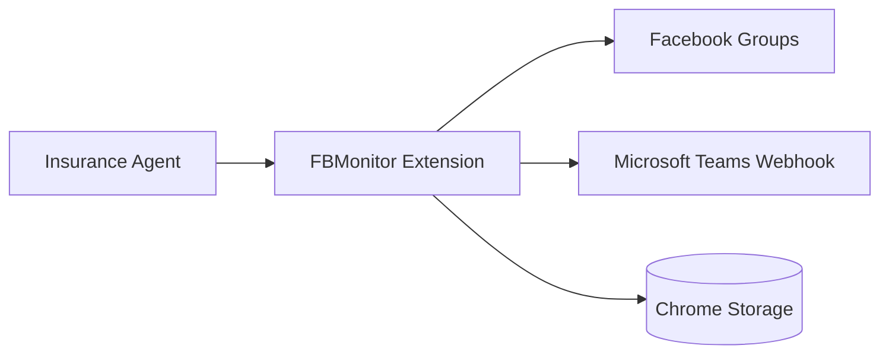
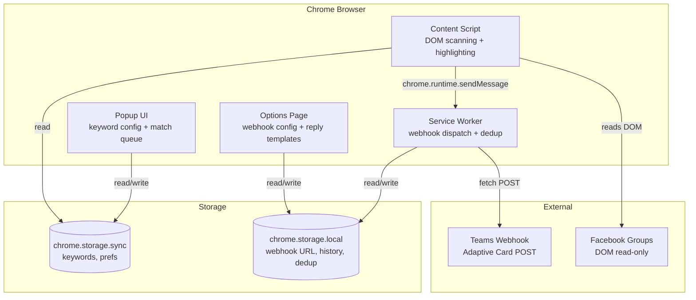

# Architecture — FBMonitor

This is the high-level system overview. Updated when the architecture meaningfully changes, not every release.

For the _why_ behind specific decisions, see `docs/adr/`.
For _upcoming_ changes, see `docs/rfc/`.
For _operational_ concerns, see `docs/runbooks/`.

## System context (C4 Level 1)

FBMonitor runs entirely in the browser as a Chrome extension. It reads Facebook group feeds via content scripts, stores configuration and match history in Chrome's built-in storage APIs, and sends webhook notifications to Microsoft Teams. There is no external backend.

## Containers (C4 Level 2)

- **Content Script** — Injected on `facebook.com/groups/*`. Uses MutationObserver to detect new posts, extracts text, matches keywords, highlights posts, injects "Copy Reply" buttons.
- **Service Worker** — MV3 background script. Receives match messages from content scripts, deduplicates, rate-limits, formats Teams Adaptive Card payloads, and dispatches webhook POSTs.
- **Popup** — Quick-access config. Add/remove keywords, toggle features, view match queue.
- **Options Page** — Full settings. Webhook URL, reply templates per keyword, match history viewer.

## Data flow

1. User scrolls a Facebook group feed.
2. Content script's MutationObserver fires on new `div[role="article"]` elements.
3. Post text is extracted and matched against stored keywords.
4. On match: post is highlighted, "Copy Reply" button injected, message sent to service worker.
5. Service worker deduplicates (hash of post URL + keywords), rate-limits (10s default), and POSTs to Teams webhook.
6. Match is logged to `chrome.storage.local` history.

## Where things live

| What               | Path                               |
| ------------------ | ---------------------------------- |
| Extension manifest | `src/manifest.json`                |
| Content scripts    | `src/content/`                     |
| FB DOM selectors   | `src/content/selectors.js`         |
| Service worker     | `src/background/service-worker.js` |
| Popup UI           | `src/popup/`                       |
| Options page       | `src/options/`                     |
| Shared modules     | `src/shared/`                      |
| Unit tests         | `tests/unit/`                      |

## Key external systems

| System          | Purpose                      | How accessed                 |
| --------------- | ---------------------------- | ---------------------------- |
| Facebook Groups | Source of posts to monitor   | DOM read via content script  |
| Microsoft Teams | Notification delivery        | Webhook POST (Adaptive Card) |
| Chrome Storage  | Config + history persistence | `chrome.storage` API         |

## Stack

- **Language(s):** JavaScript (ES2020+)
- **Framework(s):** None (vanilla JS, Chrome Extension APIs)
- **Database:** Chrome Storage (sync + local)
- **Deploy targets:** Chrome (unpacked dev, Chrome Web Store for distribution)
- **CI:** GitHub Actions

## Open architectural questions

See `docs/decisions/register.md` for the current decision register.

## Recent ADRs

- ADR-0001: Record architecture decisions
- ADR-0002: Use Manifest V3
- ADR-0003: No external backend
