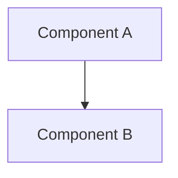

# RFC NNNN: <title>

## Context

<!-- Why is this needed? What problem does it solve? Who experiences the problem? -->

## Goals

<!-- What does success look like? Specific outcomes, not vague aspirations. -->

- …
- …

## Non-goals

<!-- What this RFC explicitly does NOT cover. Keeps scope honest. -->

- …

## Proposed approach

<!-- The actual design. Diagrams welcome (Mermaid). Be specific enough that someone else could implement it. -->

### Data model

```
(or a Mermaid ER diagram)
```

### Components



### Key flows

<!-- Describe the important request / data flows. Sequence diagrams in Mermaid help. -->

## Alternatives considered

<!-- What other approaches did we consider? Why did we reject them? Future-readers will want to know. -->

### Alternative A: …

- Pros: …
- Cons: …
- Why rejected: …

### Alternative B: …

- Pros: …
- Cons: …
- Why rejected: …

## Open questions

<!-- Unresolved questions. Track these in a paired GitHub issue (RFC discussion template). -->

- [ ] …
- [ ] …

## Pre-mortem

> If this fails in 3 months, what's the most likely cause?

Top three risks:

1. **<risk 1>** — likelihood: high/med/low. Mitigation: …
2. **<risk 2>** — likelihood: high/med/low. Mitigation: …
3. **<risk 3>** — likelihood: high/med/low. Mitigation: …

## Verification

<!-- How will we know it's working? Tests, metrics, user signals, runbook checks. -->

- …
- …

## Estimate

- **Effort estimate:** <hours / days / weeks>
- **Actual:** _to be filled in after completion_

## Decisions made (links to ADRs)

<!-- Update as ADRs are written during implementation -->

- ADR NNNN: …

## Changelog

| Date       | Change        | Reviewer |
| ---------- | ------------- | -------- |
| YYYY-MM-DD | Draft created |          |
