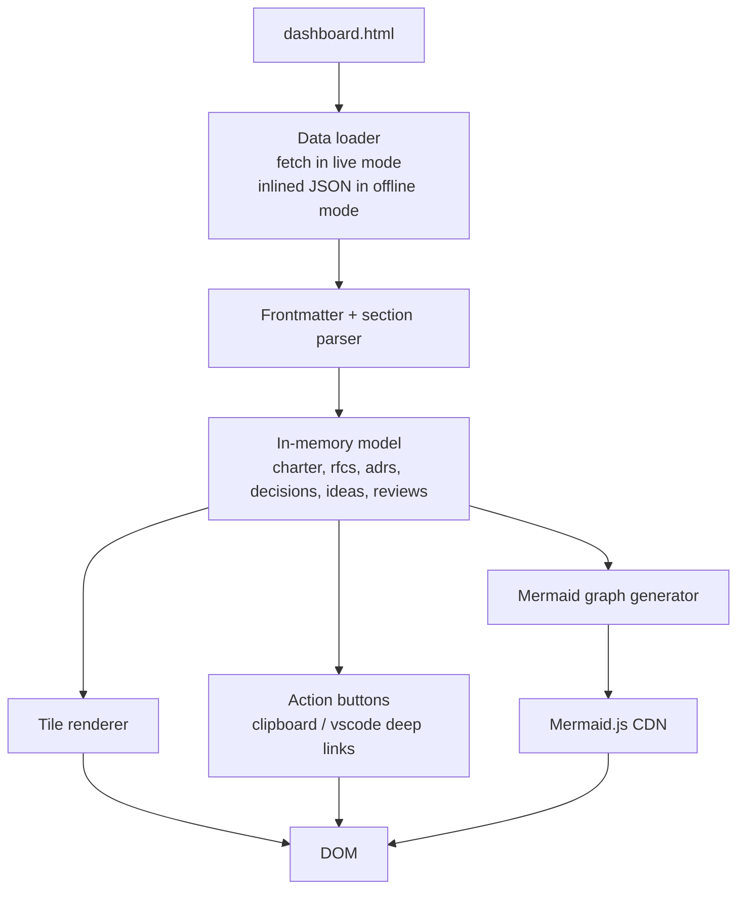

# RFC 0001: Project status dashboard

## Context

`claude-starter` defines a charter, an RFC process, an ADR process, an idea parking lot, a decision register, and a personal review cadence. The state of all of those is currently invisible — you have to walk six directories to know what's open, what's stalled, and how the artifacts relate.

A maintainer (Claude, in this project's setup) needs to surface that state at session start. A human reviewer wants to glance at one page and answer "what's in flight, what's blocked, what decisions are open, what's been parked." Both today and as the repo grows, that state is exactly the thing that's most useful — and most easily neglected — to keep visible.

A single self-contained HTML file that parses the existing markdown at load time gives us that visibility without coupling to a build tool, a static site generator, or a deployed service. It works locally via `python -m http.server` and natively via GitHub Pages.

## Goals

- Single page (`docs/dashboard.html`) that renders the project's status across charter, RFCs, ADRs, decisions, ideas, and personal reviews.
- Works in two modes — both shipped in v1:
  - **Live mode** — parses repo markdown via `fetch`. The default for local development.
  - **Offline mode** — built by `scripts/build-dashboard.py` into `docs/dashboard.offline.html` with all data inlined. For sharing the dashboard as a single file (email, screenshot context) and for environments without an HTTP server.
- **Interactive read:** clicking a tile drills into the parsed detail; the architecture graph shows cross-references between RFCs, ADRs, ideas, and decisions; clicking a graph node jumps to the matching tile.
- **Light write affordances ("Rung 1"):** clipboard + VSCode deep links. The user can launch a new RFC/ADR/idea from the dashboard without screenshotting or hand-numbering files, but the dashboard itself never writes to disk.
- Renders gracefully on a near-empty repo (claude-starter today): each section has an explicit empty state with a "start here" hint.
- No npm, no bundler, no framework. One CDN dep (Mermaid), already blessed by the global tool list.
- Designed to work both locally and over GitHub Pages from the same file. No remote required to start; if/when claude-starter ever gets one, the dashboard "just works" publicly with no code changes.

## Non-goals

- Full markdown body rendering. The dashboard reads targeted frontmatter fields and named headings; it does not render arbitrary markdown bodies.
- Writing files from the browser. Deep links and clipboard only — see "Rung 2" follow-up below.
- Mobile / responsive layout. Desktop-first per the visual-scope decision.
- Real-time updates. Refresh = reload. No file watching.
- Multi-project aggregation. One repo, one dashboard.

## Proposed approach

### File layout

```
docs/
  dashboard.html               # the live page (primary deliverable)
  dashboard.offline.html       # generated by build-dashboard.py — committed alongside or attached to releases
  dashboard.schema.md          # human-readable contract: which fields each parsed file needs
  phase.md                     # one-line current-phase file consumed by the active-phase tile
scripts/
  build-dashboard.py           # required companion — produces docs/dashboard.offline.html with data inlined
```

### Paired template changes

This RFC ships alongside small edits to three existing templates so the dashboard's contract is honored by every new artifact going forward. None of these are breaking — older files without the fields render as "not scored" / "no links."

- `docs/rfc/0000-template.md` — add optional frontmatter: `linked_adrs: []`, `linked_ideas: []`.
- `docs/adr/0000-template.md` — add optional frontmatter: `linked_rfcs: []`.
- `docs/personal/reviews/README.md` — document the `compliance_score: 0.0-1.0` frontmatter field; future weekly reviews will include it.

### Data sources and contract

| Source                                                 | Parse                       | Fields used                                                                                                 |
| ------------------------------------------------------ | --------------------------- | ----------------------------------------------------------------------------------------------------------- |
| `docs/engineering-charter.md`                          | frontmatter                 | `version`, `last_updated`                                                                                   |
| `docs/phase.md`                                        | frontmatter + first heading | `phase`, `target_end` (optional), `## Current phase: <name>`                                                |
| `docs/rfc/*.md` (excl `0000-template.md`, `README.md`) | frontmatter + section text  | `rfc`, `title`, `status`, `created`, `linked_adrs`, `linked_ideas`, **Goals** list, **Open questions** list |
| `docs/adr/*.md` (excl `0000-template.md`, `README.md`) | frontmatter                 | `adr`, `title`, `status`, `date`, `supersedes`, `superseded-by`, `linked_rfcs`                              |
| `docs/decisions/register.md`                           | table parse                 | rows in the **Open** table                                                                                  |
| `docs/ideas/*.md` (excl `README.md`)                   | first-paragraph + body scan | filename slug, `**Parked:**`, `**Earliest promotion:**`, first paragraph                                    |
| `docs/personal/reviews/*.md` (latest by filename)      | frontmatter + sections      | `date`, `compliance_score` (0.0–1.0; renders "not scored" if absent), summary heading                       |

`dashboard.schema.md` documents this contract so future RFC/idea authors know what their frontmatter needs to include.

### Parser

Hand-written, ~80 lines of JS. Two functions:

- `parseFrontmatter(text)` — flat `key: value` only, no nesting, no anchors. Returns `{}` if absent.
- `parseSections(text, headings[])` — returns the text between named `## H2` headings; used for **Goals** / **Open questions** extraction.

We intentionally do **not** vendor a YAML or markdown library: the cost (CDN dep, version pin, governance) is not worth the capability we don't need.

### Architecture / dependency graph

A Mermaid `graph LR` diagram, generated client-side from **explicit frontmatter** cross-references:

- RFC → ADR: each ADR listed in an RFC's `linked_adrs:` frontmatter array
- ADR → RFC: each RFC listed in an ADR's `linked_rfcs:` frontmatter array (reciprocal — both directions render the same edge)
- Idea → RFC: each idea slug listed in an RFC's `linked_ideas:` frontmatter array
- Decision (register row) → ADR: when an "Recently closed" outcome cell contains `ADR NNNN`, parsed as a link

Edges are deduped (the RFC→ADR and ADR→RFC views of the same link render once). Frontmatter typos (referencing a non-existent ADR) surface in the warnings tile rather than silently disappearing.

Graph nodes are clickable: clicking jumps to the corresponding tile and expands it. This is the "click through architecture, see dependencies" feature.

### Interactivity model

- Each section is a tile in a CSS grid.
- A tile shows a count + the top 3 entries.
- Clicking a tile expands it inline (no modal, no route change) — shows the full list with parsed fields.
- Hovering an RFC/ADR row reveals a tooltip with **Goals** (RFC) or **Decision** (ADR) text.
- The Mermaid graph sits in its own full-width section below the tiles.
- A `?detail=rfc-0001` URL hash auto-expands a tile on load (for deep-linking from the graph).

### Write affordances (Rung 1)

The dashboard never writes to disk. It offers two "stop screenshotting" patterns:

**Clipboard buttons:**

- "New RFC" — copies the contents of `0000-template.md` with `NNNN` replaced by next sequential number and `created: YYYY-MM-DD` filled to today. User pastes into a new file.
- "New ADR" — same pattern for ADRs.
- "Park idea" — copies the idea template with `Parked:` and `Earliest promotion:` filled.
- "Copy path" on every row.
- "Copy as task list" on the open-decisions tile.

**VSCode deep links (`vscode://file/<absolute-path>`):**

- Every row has a small "edit" icon → opens the file in VSCode.
- Empty states show "Open `docs/rfc/` in VSCode" as a quick-start link.
- These also work for VSCode Remote-SSH ([memory: user runs Remote-SSH from laptop to desktop](C:/Users/JHalv/.claude/projects/c--Users-JHalv-Dev-Sales-Tool/memory/user_remote_dev_environment.md)) — VSCode resolves the URL on whichever machine has focus.

**GitHub deep links** (when the dashboard is opened over GH Pages and we know the repo URL): "Open in GitHub" link that lands on the file in the GitHub UI. Optional polish — skip if it adds complexity.

This level of write capability costs ~20 lines, no new architecture, no new runtime. If it proves insufficient after a couple weeks of real use, escalate to Rung 2 in a follow-up RFC.

### Build-time companion

`scripts/build-dashboard.py` reads the same markdown, produces `docs/dashboard.offline.html` with a `<script type="application/json" id="data">…</script>` block inlined just before the body's closing tag. The page detects the inlined block and skips `fetch`.

Use cases:

- Sharing the dashboard as a single file (email, screenshot context).
- Environments without an HTTP server.
- A snapshot of state at a point in time (release artifact, weekly archive).

The build script uses only the Python standard library — no PyYAML, no markdown lib. Same parser logic as the in-browser version, ported to Python. The `dashboard.offline.html` file is committed alongside `dashboard.html` so a fresh clone has both available; regenerate via `python scripts/build-dashboard.py` whenever state changes meaningfully.

### Visual

- Dark theme, single column for sections (the grid is inside each section, not across them), desktop-first.
- One inline `<style>` block. CSS custom properties for the palette so it's one place to tweak.
- No external font; system stack.

### Components



### Key flows

**Live mode (file://, http.server, GH Pages):**

1. `dashboard.html` loads.
2. Loader runs a known list of `fetch()` calls against the markdown paths. Missing files are tolerated (empty state).
3. Parser turns each response into a structured object.
4. Tiles render. Mermaid graph generates from the model.
5. URL hash (`?detail=…`) auto-expands a tile if present.

**Offline mode (built file):**

1. `build-dashboard.py` parses the same markdown server-side, dumps JSON into a `<script type="application/json">` block.
2. `dashboard.offline.html` is committed (or attached to a release).
3. On load, the loader detects the inlined block and skips `fetch`.

**"New RFC" flow:**

1. User clicks the "New RFC" button in the RFC tile.
2. Dashboard reads `0000-template.md`, replaces `NNNN`/`YYYY-MM-DD`, copies result to clipboard.
3. Toast confirms: "Template copied. Paste into `docs/rfc/0002-<slug>.md`."
4. (Optional) the toast includes a "Open `docs/rfc/` in VSCode" link.

## Alternatives considered

### Alternative A: Build-time only (no live mode)

- Pros: simpler — no fetch, no CORS questions, parser runs in Python where libraries exist.
- Cons: dashboard goes stale between builds; loses the "open the file and it just works" property; adds a pre-commit hook to the things you can forget.
- **Why rejected:** breaks the "automate by default" intent. A dashboard that requires a build before it's accurate is a dashboard that's accurate less often than it should be.

### Alternative B: Vendor `marked.js` + `js-yaml` via CDN

- Pros: full markdown rendering, nested YAML support.
- Cons: two CDN deps (versioning, offline-broken without vendoring), governance cost, paying for capability we don't need (we don't render markdown bodies).
- **Why rejected:** charter Section 5 ("boring tech, don't adopt new frameworks without a concrete payoff"). The hand-written parser is 80 lines and covers what we need.

### Alternative C: D3.js / Cytoscape.js / vis.js for the graph

- Pros: physics-based layout, drag-to-pan, zoom, richer interactions.
- Cons: heavy dep, learning curve, governance cost; Mermaid is already on the global tools list.
- **Why rejected:** Mermaid covers "show the dependency graph" cleanly via declarative syntax we generate. If the interactivity demand grows, revisit in a future RFC.

### Alternative D: Real write capability now (Rung 2 / Rung 3)

- Rung 2 — File System Access API: writes files from the browser. Chrome/Edge only; per-session permission prompt; ~100 extra lines.
- Rung 3 — local Python backend with POST endpoints: real writes, every browser; breaks "single HTML file"; ~150 extra lines + new runtime workflow.
- **Why rejected:** charter Section 1 ("80% for minimal work") and Section 8 (two-week rule on new ideas). Most "I wish this could write" urges fade once the read view exists. Rung 2 is a clean follow-on RFC if Rung 1 proves insufficient.

## Decisions locked in

The four open questions from the draft were resolved during RFC review (2026-05-10):

1. **Active-phase tile** → reads `docs/phase.md`. First heading (`## Current phase: <name>`) is the display name; optional frontmatter (`phase: N`, `target_end: YYYY-MM-DD`) adds metadata. Empty state when the file is absent: "No phase set — create `docs/phase.md`."
2. **Compliance score source** → review frontmatter field `compliance_score: 0.85` (0.0–1.0). Renders "not scored" when absent. The personal-review README and the scheduled review agent's prompt both get updated to populate it going forward. Existing reviews (none yet) are unaffected.
3. **Graph cross-references** → **explicit frontmatter**. RFC has `linked_adrs: [...]` and `linked_ideas: [...]`; ADR has `linked_rfcs: [...]`. Decision register's "Recently closed" outcome column is parsed for `ADR NNNN` patterns (the register format already uses this; no schema change). Templates updated as part of this RFC's PR; existing files (template stubs only at this point) are unaffected.
4. **GH Pages** → designed for both, defaults to local. No remote required to start. "Open in GitHub" deep links no-op gracefully when no remote is configured.

## Remaining open questions

Implementation details only — not design questions:

- [ ] **Clipboard fallback** — the Clipboard API requires a secure context (https or localhost). When opened over `file://` the buttons should fall back to selecting the prefilled text inside a `<textarea>` for manual copy. Implementation will handle.

## Pre-mortem

> If this fails in 3 months, what's the most likely cause?

Top three risks:

1. **Schema drift** — likelihood: **high**. Someone (Claude or human) changes an RFC's frontmatter shape and the dashboard silently shows wrong/empty fields without telling anyone. **Mitigation:** parser logs `[dashboard] missing field "status" in docs/rfc/0003-foo.md` to console; `dashboard.schema.md` documents the contract; a sanity-check section in the dashboard ("3 RFCs parsed, 1 with warnings") makes drift visible at a glance.
2. **`fetch` on `file://`** — likelihood: **med**. Chrome blocks `fetch` on `file://` by default. A user double-clicks the HTML and sees an empty dashboard with cryptic console errors. **Mitigation:** the page detects `location.protocol === 'file:'` and shows an explicit banner: "Open via `python -m http.server` from the repo root, or use the offline build." The README's quick-start documents both.
3. **Mermaid CDN unavailable** — likelihood: **low** but possible (network outage, ad blocker, corporate firewall). The graph silently fails. **Mitigation:** `try/catch` around Mermaid init; on failure, render a text fallback ("Graph unavailable — edges: RFC 0001 → ADR 0001, …"). Later, optionally vendor Mermaid into `docs/vendor/` to remove the dep entirely.

## Verification

- Open `docs/dashboard.html` via `python -m http.server` from repo root. Every tile renders — either with sample data added during implementation, or with the explicit "no entries yet" empty state.
- Add a real RFC to `docs/rfc/`, refresh the page, verify it appears.
- Add a row to `docs/decisions/register.md`, refresh, verify it appears.
- Open the file via `file://` (double-click). Verify the banner explains how to run it properly.
- `python scripts/build-dashboard.py` produces `docs/dashboard.offline.html` that opens correctly via `file://`.
- Mermaid graph renders. Disable Mermaid (block the CDN in devtools) and verify text fallback.
- "New RFC" button copies a correctly numbered, correctly dated template to clipboard. Pasted into a new file, dashboard reflects the new RFC after refresh.
- VSCode deep link opens the right file (manual check — depends on local VSCode install).

## Estimate

- **Effort estimate:** 3–4 hours focused work (parser, tiles, graph, write affordances, build script).
- **Actual:** ~3 hours focused work across two commits (impl + Mermaid vendoring). Within estimate.

## Decisions made (links to ADRs)

- _none yet — will be filled in during implementation if the open questions above warrant ADRs_

## Changelog

| Date       | Change                                                                                                     | Reviewer    |
| ---------- | ---------------------------------------------------------------------------------------------------------- | ----------- |
| 2026-05-10 | Draft created                                                                                              |             |
| 2026-05-10 | Four open questions resolved; build script promoted to required deliverable; paired template changes added | Jhalvordson |
| 2026-05-11 | Implemented in commits cb0e48a (impl) and 386241a (vendor Mermaid). Status: implemented.                   | Jhalvordson |
